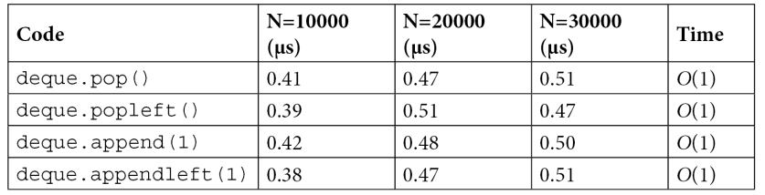
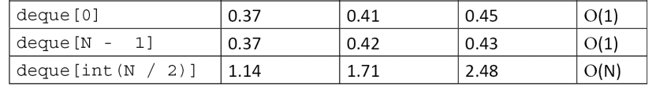
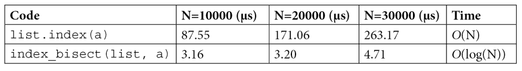
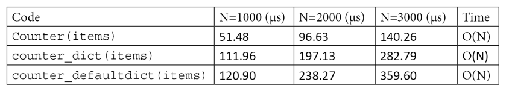
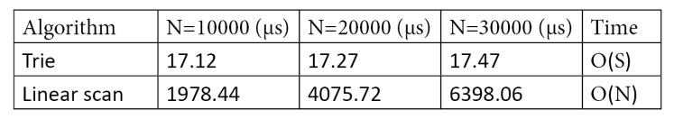

# Programming Design Patterns in Python

## Profiling

[Profilers in Python](https://docs.python.org/3/library/profile.html)

_Profiling_ - technique that allows to pinpoint the most resource-intensive parts of an application.

_Profiler_ - program that runs an aplication and monitors how long each function takes to execute, so it detects the functions on which our application spends of its time. 

```pytest-benchmark``` is used for testing running time of specific functions. See [documentation](https://pytest-benchmark.readthedocs.io/en/stable/usage.html) of pytest-benchmark for details.


Another profiling tool is ```cProfile```.

```python
    from simul import benchmark
    import cProfile

    pr = cProfile.Profile()
    pr.enable()
    benchmark()
    pr.disable()
    pr.print_stats()
```

_KCachegrind_ - graphical user interface visualizing profiling output. 

How to do profiling:

1. Check modules of the app with cProfile or other profiler in order to understand which module is time-consuming
2. Use ```line_profiler``` to check functions line by line. See the [documentation](https://github.com/rkern/line_profiler)

### Profiling memory usage

Memory profiler summarizes the information of memory usage of process. 

## Optimizing code

Methods of optimzation:

- improve algorithms used
- minimize the number of instructions

### Using the right data structures

Estimation time of operations per data sctructure:

**_list of 10,000 size_**

<figure markdown>
  { width="800" }
</figure>

**_deque (double-ended queue) of 10,000 size_**

<figure markdown>
  { width="800" }
  { width="800" }
</figure>

!!! tip
    A simple way to speed up searches in lists is to keep the array sorted and perform a binary search using the `bisect` [module](https://docs.python.org/3.10/library/bisect.html). `bisect` allows fast search on sorted arrays. 
    ```python
        insert bisect

        collection = [1, 2, 4, 5, 6]
        bisect.bisect(collection, 3)
        # Result: 2
    ```
    This function uses the binary search algorithm that has $O(log(N))$ running time.

    The efficiency of the `bisect` function:
    <figure markdown>
    { width="800" }
    </figure>

**_dictionaries_**

The efficiency of the `Counter` function:
<figure markdown>
{ width="800" }
</figure>

Building an in-memory search index using a hash map

```python

    docs = ["the cat is under the table", "the dog is under the table", "cats and dogs smell roses", "Carla eats an apple"]
    
    index = {} #(1)
    for i, doc in enumerate(docs):
        for word in doc.split(): #(2)
            if word not in index: #(3)
                index[word] = [i]
            else:
                index[word].append(i)
```

1. Building an index
2. We iterate over each term in the document
3. We build a list containing the indices where the term appears

Now if we want to do search (for example we want to retrieve all documents contain the `table` term), we can easily use it to query the index:

```python
results = index["table"]
result_documents = [docs[i] for i in results]
```

And it takes us $O(1)$ time complexity. So we can query any number of documents in constant time. 

**_sets_**

Unordered collections of unique elements.

Time complexity of _union_, _intersection_ and _difference_ operations of two sets.

<figure markdown>
{ width="400" }
</figure>

Application of sets in practice: boolean search - for example, query all documents contain multiple terms. For example, we may want to search for all the documents that contain the words _cat_ and _table_. This kind of query can be efficiently computed by taking the intersection between the set of documents containing cat and the set of documents containing table.

```python
    index = {} #(1)
    for i, doc in enumerate(docs):  
        for word in doc.split(): #(2) 
            if word not in index:
                index[word] = {i} #(3)
            else:
                index[word].add(i)
    
    index['cat'].intersection(index['table']) #(4) 
```

1. Building an index using sets
2. We iterate over each term in the document
3. We build a set containing the indices where the term appears
4. Querying the documents containing both "cat" and "table"

**_heaps_**

Heaps are data structures designed to quickly fin and extract the maximum (or minimum) value in a collection. 

Application of heaps in practice: process of incoming tasks in order of maximum priority. Insertion or extraction of maximum value takes $O(log(N))$ time complexity.

```python
    import heapq

    collection = [10, 3, 3, 4, 5, 6]
    heapq.heapify(collection)

    heapq.heappop(collection) #(1)
```

1. extract the minimum value, returns: 3

Another example of performing insertion and extraction

```python
    from queue import PriorityQueue

    queue = PriorityQueue()
    for element in collection:
        queue.put(element)

queue.get() #(1)
```

1. returns: 3

If the maximum element is required we can just multiply each element of the list by -1, i.e. invert the order of elements. 

If it is needed to associate an object (for example, task) with each number (and make priority order) we can insert tuples `(number, object)`:

```python
    queue = PriorityQueue()
    queue.put((3, "priority 3"))
    queue.put((2, "priority 2"))
    queue.put((1, "priority 1"))

    queue.get() #(1)
```

1. returns: (1, "priority 1")

**_tries_**

Tries are extremely fast at matching a list of strings against a prefix. This is especially useful when implementing features such as _search as you type_ and _autocompletion_, where the list of available completions is very large and short response
times are required.

```python
    from patricia import trie
    from random import choice
    from string import ascii_uppercase

    def random_string(length):
        """Produce a random string made of *length* uppercase \
        ascii characters"""
        return ''.join(choice(ascii_uppercase) for i in \
        range(length))

    strings = [random_string(32) for i in range(10000)]

    strings_dict = {s:0 for s in strings} #(1)
    strings_trie = trie(**strings_dict)

    matches = list(strings_trie.iter('AA'))
```

1. a dictionary where all values are 0

<figure markdown>
{ width="600" }
</figure>

### Using caching and memorization to improve efficiency

The idea behind caching is to store expensive results in a temporary location (**cache**) that can be located in memory, on disk, or in a remote location. 