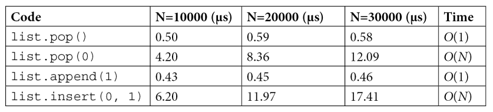
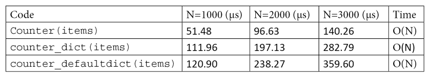
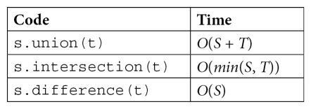

# Efficient Programming in Python

**Sources**: 

- Books: 

    - [Advanced Python Programming](https://www.packtpub.com/product/advanced-python-programming/9781838551216?utm_source=github&utm_medium=repository&utm_campaign=)

## Profiling

[Profilers in Python](https://docs.python.org/3/library/profile.html)

_Profiling_ - technique that allows to pinpoint the most resource-intensive parts of an application.

_Profiler_ - program that runs an aplication and monitors how long each function takes to execute, so it detects the functions on which our application spends of its time. 

```pytest-benchmark``` is used for testing running time of specific functions. See [documentation](https://pytest-benchmark.readthedocs.io/en/stable/usage.html) of pytest-benchmark for details.


Another profiling tool is ```cProfile```.

```python
    from simul import benchmark
    import cProfile

    pr = cProfile.Profile()
    pr.enable()
    benchmark()
    pr.disable()
    pr.print_stats()
```

_KCachegrind_ - graphical user interface visualizing profiling output. 

How to do profiling:

1. Check modules of the app with cProfile or other profiler in order to understand which module is time-consuming
2. Use ```line_profiler``` to check functions line by line. See the [documentation](https://github.com/rkern/line_profiler)

### Profiling memory usage

Memory profiler summarizes the information of memory usage of process. 

## Optimizing code

Methods of optimzation:

- improve algorithms used
- minimize the number of instructions

### Using the right data structures

Estimation time of operations per data sctructure:

**_list of 10,000 size_**

<figure markdown>
  { width="800" }
</figure>

**_deque (double-ended queue) of 10,000 size_**

<figure markdown>
  { width="800" }
  { width="800" }
</figure>

!!! tip
    A simple way to speed up searches in lists is to keep the array sorted and perform a binary search using the `bisect` [module](https://docs.python.org/3.10/library/bisect.html). `bisect` allows fast search on sorted arrays. 
    ```python
        insert bisect

        collection = [1, 2, 4, 5, 6]
        bisect.bisect(collection, 3)
        # Result: 2
    ```
    This function uses the binary search algorithm that has $O(log(N))$ running time.

    The efficiency of the `bisect` function:
    <figure markdown>
    { width="800" }
    </figure>

**_dictionaries_**

The efficiency of the `Counter` function:
<figure markdown>
{ width="800" }
</figure>

Building an in-memory search index using a hash map

```python

    docs = ["the cat is under the table", "the dog is under the table", "cats and dogs smell roses", "Carla eats an apple"]
    
    index = {} #(1)
    for i, doc in enumerate(docs):
        for word in doc.split(): #(2)
            if word not in index: #(3)
                index[word] = [i]
            else:
                index[word].append(i)
```

1. Building an index
2. We iterate over each term in the document
3. We build a list containing the indices where the term appears

Now if we want to do search (for example we want to retrieve all documents contain the `table` term), we can easily use it to query the index:

```python
results = index["table"]
result_documents = [docs[i] for i in results]
```

And it takes us $O(1)$ time complexity. So we can query any number of documents in constant time. 

**_sets_**

Unordered collections of unique elements.

Time complexity of _union_, _intersection_ and _difference_ operations of two sets.

<figure markdown>
{ width="400" }
</figure>

Application of sets in practice: boolean search - for example, query all documents contain multiple terms. For example, we may want to search for all the documents that contain the words _cat_ and _table_. This kind of query can be efficiently computed by taking the intersection between the set of documents containing cat and the set of documents containing table.

```python
    index = {} #(1)
    for i, doc in enumerate(docs):  
        for word in doc.split(): #(2) 
            if word not in index:
                index[word] = {i} #(3)
            else:
                index[word].add(i)
    
    index['cat'].intersection(index['table']) #(4) 
```

1. Building an index using sets
2. We iterate over each term in the document
3. We build a set containing the indices where the term appears
4. Querying the documents containing both "cat" and "table"

**_heaps_**

Heaps are data structures designed to quickly fin and extract the maximum (or minimum) value in a collection. 

Application of heaps in practice: process of incoming tasks in order of maximum priority. Insertion or extraction of maximum value takes $O(log(N))$ time complexity.

```python
    import heapq

    collection = [10, 3, 3, 4, 5, 6]
    heapq.heapify(collection)

    heapq.heappop(collection) #(1)
```

1. extract the minimum value, returns: 3

Another example of performing insertion and extraction

```python
    from queue import PriorityQueue

    queue = PriorityQueue()
    for element in collection:
        queue.put(element)

queue.get() #(1)
```

1. returns: 3

If the maximum element is required we can just multiply each element of the list by -1, i.e. invert the order of elements. 

If it is needed to associate an object (for example, task) with each number (and make priority order) we can insert tuples `(number, object)`:

```python
    queue = PriorityQueue()
    queue.put((3, "priority 3"))
    queue.put((2, "priority 2"))
    queue.put((1, "priority 1"))

    queue.get() #(1)
```

1. returns: (1, "priority 1")

**_tries_**

Tries are extremely fast at matching a list of strings against a prefix. This is especially useful when implementing features such as _search as you type_ and _autocompletion_, where the list of available completions is very large and short response
times are required.

```python
    from patricia import trie
    from random import choice
    from string import ascii_uppercase

    def random_string(length):
        """Produce a random string made of *length* uppercase \
        ascii characters"""
        return ''.join(choice(ascii_uppercase) for i in \
        range(length))

    strings = [random_string(32) for i in range(10000)]

    strings_dict = {s:0 for s in strings} #(1)
    strings_trie = trie(**strings_dict)

    matches = list(strings_trie.iter('AA'))
```

1. a dictionary where all values are 0

<figure markdown>
{ width="600" }
</figure>

### Algorithmic optimization
#### Using caching and memorization to improve efficiency

The idea behind caching is to store expensive results in a temporary location (**cache**) that can be located in memory, on disk, or in a remote location. 

The cache functions are located inside `functools` python module. See [documentation](https://docs.python.org/3/library/functools.html)

Example of `lru_cache()` function:

```python
    from functools import lru_cache
    
    @lru_cache()
    def sum2(a, b):
        print("Calculating {} + {}".format(a, b))
        return a + b

    print(sum2(1, 2)) #(1)
    print(sum2(1, 2)) #(2)
```

1.  Output: 
        # Calculating 1 + 2
        # 3
2.  Second time function is not called again. Result was cached.
    Output:
        # 3

We can restrict max size of cache by `@lru_cache(max_size=16)`. In this case new values will replace old ones based on strategy _least recently used_. 

Other third-party module which allows to implement cache is [Joblib](https://joblib.readthedocs.io/en/latest/)  
Basically it works same as `lru_cache()` but the results will be stored on disk in the directory specified by the `cachedir` argument:

```python
    from joblib import Memory

    memory = Memory(cachedir='/path/to/cachedir')

    @memory.cache
    def sum2(a, b):
        return a + b
```

#### Using iteration with comprehensions and generators

To speed up looping we can use _comprehensions_ and _generators_. 
Time comparison:

```python
    def loop():
        res = []
        for i in range(100000):
            res.append(i * i)
        return sum(res)
    
    def dict_loop():
        res = {}
        for i in range(100000):
            res[i] = i
        return res

    def comprehension():
        return sum([i * i for i in range(100000)])

    def generator():
        return sum(i * i for i in range(100000))

    def dict_comprehension():
        return {i: i for i in range(100000)}

    %timeit loop()
    100 loops, best of 3: 16.1 ms per loop

    %timeit comprehension()
    100 loops, best of 3: 10.1 ms per loop

    %timeit generator()
    100 loops, best of 3: 12.4 ms per loop

    %timeit dict_loop()
    100 loops, best of 3: 13.2 ms per loop

    %timeit dict_comprehension()
    100 loops, best of 3: 12.8 ms per loop
```

Example of efficient looping using `filter` and `map` functions in combination with generators:

```python
    def map_comprehension(numbers):
        a = [n * 2 for n in numbers]
        b = [n ** 2 for n in a]
        c = [n ** 0.33 for n in b]
        return max(c)
```

The problem here is that for every list comprehension we are allocating a new list, which increases memory usage. We can solve it by implementing generators:

```python
    def map_normal(numbers):
        a = map(lambda n: n * 2, numbers)
        b = map(lambda n: n ** 2, a)
        c = map(lambda n: n ** 0.33, b)
        return max(c)

    %load_ext memory_profiler
    numbers = range(1000000)

    %memit map_comprehension(numbers)
    peak memory: 166.33 MiB, increment: 102.54 MiB

    %memit map_normal(numbers)
    peak memory: 71.04 MiB, increment: 0.00 MiB
```

More about [generators](https://realpython.com/introduction-to-python-generators/)

#### Using Numpy for high-speed calculations on big arrays

Numpy allows to manipulate multidimensional numerical data and perform mathematical computations that are highly optimized.

#### Using Pandas with database-style data

Pandas allows to work with labeled, categorical data (a.k.a dictionaries in Python)

Create `pd.Series` object:

```python
    import pandas as pd

    patients = [0, 1, 2, 3]
    effective = [True, True, False, False]
    effective_series = pd.Series(effective, index=patients)
```

In pandas keys are not limited to integers compared to numpy:

```python
    patients = ["a", "b", "c", "d"]
    effective = [True, True, False, False]
    effective_series = pd.Series(effective, index=patients)
```

We can create a dataframe to hold key-value data:

```python
    patients = ["a", "b", "c", "d"]
    columns = {
        "systolic_blood_pressure_initial": [120, 126, 130, 115],
        "diastolic_blood_pressure_initial": [75, 85, 90, 87],
        "systolic_blood_pressure_final": [115, 123, 130, 118],
        "diastolic_blood_pressure_final": [70, 82, 92, 87]
    }
    df = pd.DataFrame(columns, index=patients)
```

Indexing Series and DataFrame objects:

1. Using _key_ of the element

```python
    effective_series.loc["a"]
```

2. Using _position_ of the element

```python
    effective_series.iloc[0]
```

3. Using _position_ of the element

```python
    effective_series.iloc[0]
```

Also pandas supports such useful operations as `join` for filtering data and extracting specific rows. 

#### Using xarray 

Xarray combines best from Numpy and Pandas - working with labeled multidimensional data. For details see the [xarray-documentation](https://docs.xarray.dev/en/stable/getting-started-guide/installing.html)

Example: 

```python
    import xarray as xr
    
    ds = xr.Dataset.from_dataframe(df)
```

#### Using Cython to increase performance

Use [documentation](https://cython.readthedocs.io/en/latest/) for detailed overview of its functionality

