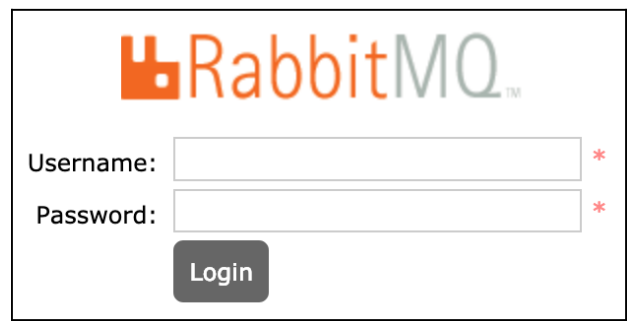
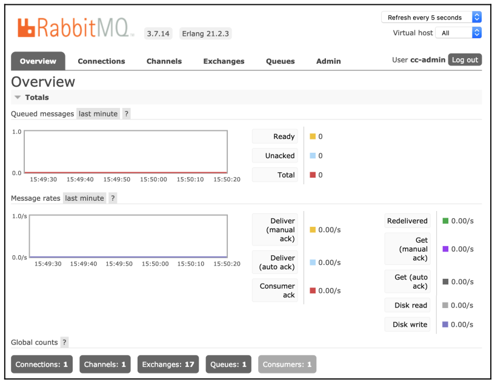
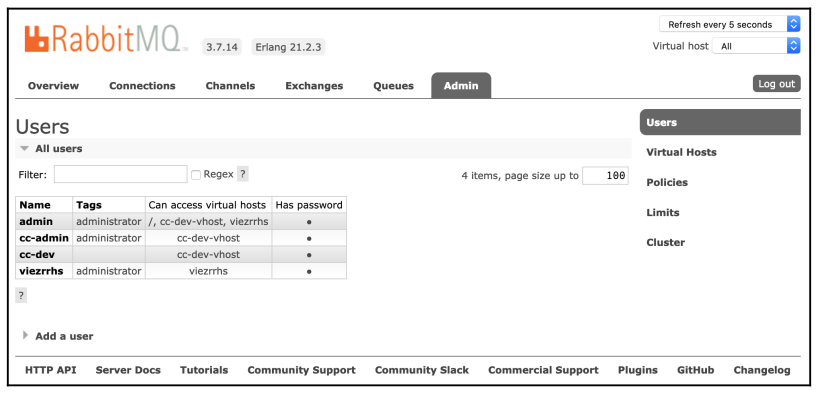
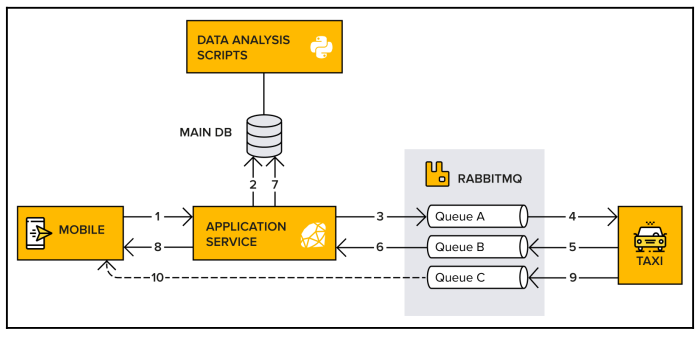
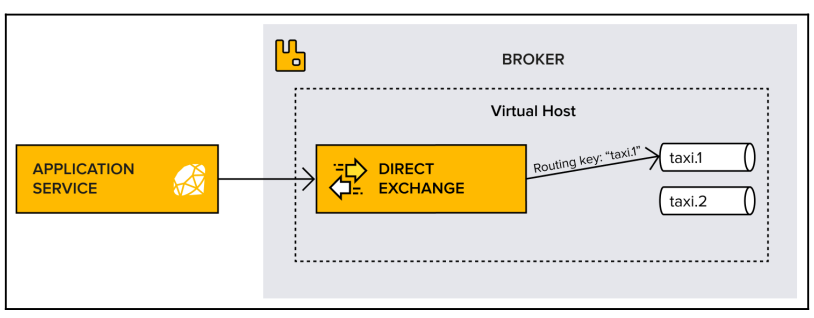
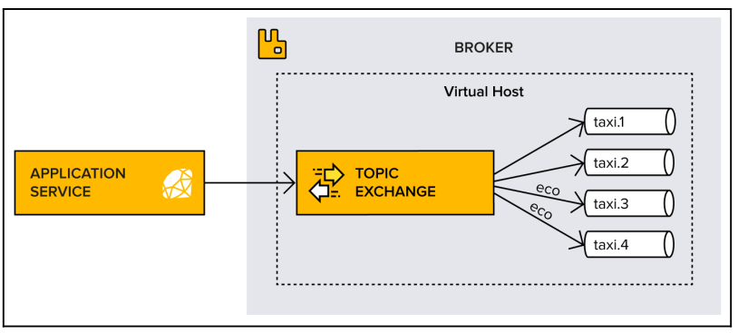

Source:

- Books:

    - [David Dossot* Lovisa Johansson - RabbitMQ essentials * build distributed and scalable applications with message queuing using RabbitMQ (2020)](https://www.amazon.com.tr/RabbitMQ-Essentials-distributed-scalable-applications/dp/1789131669)

- RabbitMQ [documentation](https://www.rabbitmq.com/)

## Key Definitions

**Broker or message broker** is a piece of software that receives messages
from one application or service, and delivers them to another application,
service, or broker.

**Virtual host, vhost** exists within the broker. It's a way to separate
applications that are using the same RabbitMQ instance, similar to a logical
container inside a broker; for example, separating working environments into
development on one vhost and staging on another, keeping them within the same broker instead of setting up multiple brokers. Users, exchanges, queues, and so on are isolated on one specific vhost. A user connected to a particular vhost cannot access any resources (queue, exchange, and so on) from another vhost. Users can have different access privileges to different vhosts.

**Connection** is a physical network (TCP) connection between the application (publisher/consumer) and a broker. When the client disconnects or a system failure occurs, the connection is closed.

**Channel** is a virtual connection inside a connection. It reuses a connection, forgoing the need to reauthorize and open a new TCP stream. When messages are published or consumed, it is done over a channel. Many channels can be established within a single connection.

**Exchange** entity is in charge of applying routing rules for messages, making sure that messages are reaching their final destination. In other words, the exchange ensures that the received message ends up in the correct queues. Which queue the message ends up in depends on the rules defined by the exchange type. A queue needs to be bound to at least one exchange to be able to receive messages. Routing rules include direct (point-to-point), topic (publish-subscribe), fanout (multicast), and header exchanges.

**Queue** is a sequence of items; in this case, messages. The queue exists within the broker.

**Binding** is a virtual link between an exchange and a queue within the broker. It enables messages to flow from an exchange to a queue.

**Messaging** or **message queuing** is a method of communication between applications or components.

**Messages** are typically small requests, replies, status updates, or even just information.

A **message queue** provides a temporary place for these messages to stay, allowing applications to send and receive them as necessary.

**RabbitMQ** is an open source message broker that acts as the intermediary or middleman for independent applications, giving them a common platform to communicate.

**RabbitMQ** mainly uses an Erlang-based implementation of the **Advanced Message Queuing Protocol (AMQP)**, which supports advanced features such as clustering and the complex routing of messages.

Message queuing is a one-way communication style that provides asynchronous interaction between systems.
Most common message exchange pattern is **request-response**. It is synchronous, so it follows tight-coupling between client and server and has deep impact on the architecture of the whole system (hard to evolve, scale and ship in independent releases). 

<figure markdown>
  {width="500" }
</figure>

**Message-queuing exchange pattern** is a one-way style of interaction where one system asynchronously interacts with another system via messages through a message broker. Requesting system doesn't wait for response, it continues processing no matter what.  

<figure markdown>
  {width="600" }
</figure>

Systems and applications play both the role of message publishers (producers) and message consumers (subscribers).
Advantage of using this style of interaction is that systems become loosely coupled with each other. They do not need to know the location of other nodes on the network; a mere name is enough to reach them.

<figure markdown>
  {width="600" }
</figure>

The architecture represented via message queuing allows for the following:

- The publishers or consumers can be updated one by one, without them impacting each other.
- The performance of each side leaves the other side unaffected.
- The publishers or consumers are allowed to fail without impacting each other.
- The number of instances of publishers and consumers to scale and to accommodate their workload in complete independence.
- Technology mixing between consumer and publishers.

Overview of concepts in AMQP:

<figure markdown>
  {width="800" }
</figure>

## RabbitMQ features

RabbitMQ can be used as standalone instance or as a cluster on multiple servers

<figure markdown>
  {width="500" }
</figure>

RabbitMQ brokers can be connected together using different techniques, such as federation and shovels, in order to form messaging topologies with smart message routing across brokers and the capacity to span multiple data centers.

<figure markdown>
  {width="800" }
</figure>

### Message queues between microservices

Message queues are often used in between microservices. Microservices are not strictly connected to each other. They instead use message queues to keep in touch. One service asynchronously pushes messages to a queue and those messages are delivered to the correct destination when the consumer is ready.

For example, a webstore:

<figure markdown>
  {width="600" }
</figure>

### Event and tasks

Events are notifications that tell applications when something has happened. One
application can subscribe to events from another application and respond by creating and handling tasks for themselves. A typical use case is when RabbitMQ acts as a task queue that handles **slow** operations.

Messages are first entering the queue and then handled. New tasks are then added to another queue:

<figure markdown>
  {width="600" }
</figure>

### Installation on Ubuntu

Download the latest releases of the installed software, and verify that `curl`, `apt-transport-https` and GnuPG are on the system

```console
    $ apt upgrade
    $ sudo apt install curl gnupg -y
    $ sudo apt install apt-transport-https
```


Ubuntu does not include RabbitMQ by default, so it must be added to the repository key before you proceed. Execute the following set of commands in a Terminal:

```console
    $ curl -fsSL
    https://github.com/rabbitmq/signing-keys/releases/download/2.0/rabbitmq-rel
    ease-signing-key.asc
    sudo apt-key add -
    sudo tee /etc/apt/sources.list.d/bintray.rabbitmq.list <<EOF
    deb https://dl.bintray.com/rabbitmq-erlang/debian [os release name] erlang
    deb https://dl.bintray.com/rabbitmq/debian [os release name] main
    EOF
```

Install:

```console
    $ sudo apt install -y rabbitmq-server
    $ sudo apt install librabbitmq-dev
```

#### RabbitMQ installation on Docker

```console
    $ docker pull rabbitmq

    $ docker run -d --hostname my-rabbit --name my-rabbit -p 5672:5672 -p
    15672:15672 -e RABBITMQ_ERLANG_COOKIE='cookie_for_clustering' -e
    RABBITMQ_DEFAULT_USER=user -e RABBITMQ_DEFAULT_PASS=password --name some-
    rabbit rabbitmq:3-management
```

#### Starting RabbitMQ

```console
    $ rabbitmq-server start
```

Run the brker as a service:

```console
    $ sudo systemctl enable rabbitmq-server
    $ sudo systemctl start rabbitmq-server
    $ sudo systemctl status rabbitmq-server
```

#### Veryfying that RabbitMQ is running

```console
    $ sudo service rabbitmq-server status
```

#### Installing the management plugin (Web UI)

```console
    $ sudo rabbitmq-plugins enable rabbitmq_management
    Enabling plugins on node rabbit@host:
    rabbitmq_management
    The following plugins have been configured:
    rabbitmq_consistent_hash_exchange
    rabbitmq_event_exchange
    rabbitmq_federation
    rabbitmq_management
    rabbitmq_management_agent
    rabbitmq_shovel
    rabbitmq_web_dispatch
    Applying plugin configuration to rabbit@host...
    The following plugins have been enabled:
    rabbitmq_management
    rabbitmq_management_agent
    rabbitmq_web_dispatch
```

Navigate to `http://<hostname>:15672`

<figure markdown>
  {width="400" }
</figure>

Configure users:

```console
    $ sudo rabbitmqctl add_user cc-admin taxi123
    Adding user "cc-admin" ...


    $ sudo rabbitmqctl set_user_tags cc-admin administrator
    Setting tags for user "cc-admin" to [administrator] ...
```

Change guest default user and default password:

```console
    $ sudo rabbitmqctl change_password guest guest123
```

Main dashboard of the management console

<figure markdown>
  {width="800" }
</figure>

Create the `cc-dev` user:

```console
    $ sudo rabbitmqctl add_user cc-dev taxi123
    Adding user "cc-dev" ...
```

Create a vhost called `cc-dev-vhost`:

```console
    $ sudo rabbitmqctl add_vhost cc-dev-vhost
    Adding vhost "cc-dev-vhost" ...
```

As it stands, neither the `cc-admin `nor `cc-dev` users have permission to do anything on `cc-dev-vhost`. Fix this by giving the vhost full rights, as follows:

```console
    $ sudo rabbitmqctl set_permissions -p cc-dev-vhost cc-admin ".*" ".*" ".*"
    Setting permissions for user "cc-admin" in vhost "cc-dev-vhost" ... 
    
    $ sudo rabbitmqctl set_permissions -p cc-dev-vhost cc-dev ".*" ".*" ".*"
    Setting permissions for user "cc-dev" in vhost "cc-dev-vhost" ...
```

It is a triplet of permissions for the considered vhost, which grants **configure**, **write**, and **read** permissions on the designated resources for the considered user and vhost. See access control commands in the [documentation](https://www.rabbitmq.com/access-control.html)

Alternative way is to do it via the management console:

<figure markdown>
  {width="800" }
</figure>

### Example of RabbitMQ usage in real application

Let's say we want to create Taxi App like this:

<figure markdown>
  {width="800" }
</figure>

The following steps on the above diagram:

1. A customer uses CC's mobile application to book a taxi. A request is now sent
from the mobile application to the Application Service. This request includes
information about the trip that the customer wants to book.
2. The Application Service stores the request in a database.
3. The Application Service adds a message with information about the trip to a
queue in RabbitMQ.
4. Connected taxi cars subscribe to the message (the booking request).
5. A taxi responds to the customer by sending a message back to RabbitMQ.
6. The Application Service subscribes to the messages.
7. Again, the Application Service stores the information in a database.
8. The Application Service forwards the information to the customer.
9. The taxi app starts to automatically send the taxi's geographical location at a
given interval to RabbitMQ.
10. The location of the taxi is then passed straight to the customer's mobile
application, via WebSockets, so that they know when the taxi arrives.

**Direct Exchange routing pattern**

<figure markdown>
  {width="800" }
</figure>

**Topic routing pattern**

!!! note
    A routing pattern consists of several words separated by dots. A best
    practice to follow is to structure routing keys from the most general
    element to the most specific one, such as news.economy.usa or
    europe.sweden.stockholm.
    The topic exchange supports strict routing key matching and will also
    perform wildcard matching using * and # as placeholders for exactly one
    word and zero or more words, respectively.

<figure markdown>
  {width="800" }
</figure>

**Important points about consumers and queues in RabbitMQ:**

- A queue can have multiple consumers (unless the exclusive tag is used).
- Each channel can have multiple consumers.
- Each consumer uses server resources, so it is best to make sure not to use too
many consumers.
- Channels are full-duplex, meaning that one channel can be used to both publish
and consume messages.

!!! note
    There is no logical limit to the number of channels or consumers a
    RabbitMQ broker can handle. There are, however, limiting factors, such as
    available memory, broker CPU power, and network bandwidth.
    As each channel mobilizes memory and consumes CPU power, limiting
    the number of channels or consumers may be a consideration in some
    environments. The administrator can configure a maximum number of
    channels per connection by using the `channel_max` parameter.
