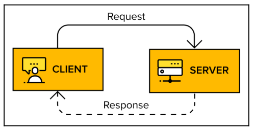
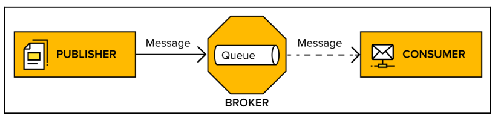
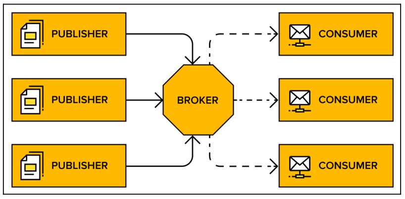
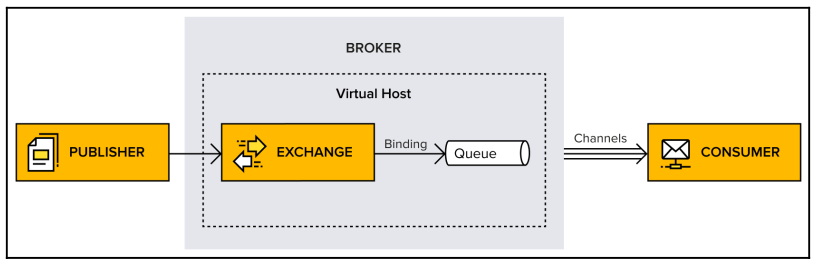
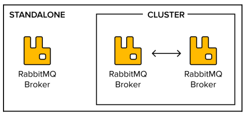
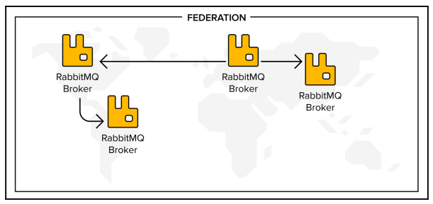
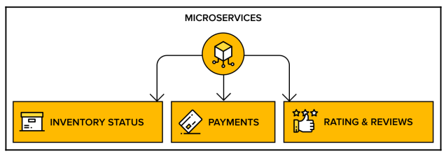
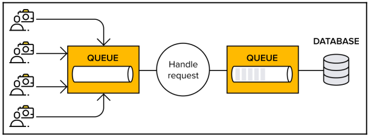

Source:

- Books:

    - [David Dossot* Lovisa Johansson - RabbitMQ essentials * build distributed and scalable applications with message queuing using RabbitMQ (2020)](https://www.amazon.com.tr/RabbitMQ-Essentials-distributed-scalable-applications/dp/1789131669)

- RabbitMQ [documentation](https://www.rabbitmq.com/)

## Key Definitions

**Broker or message broker** is a piece of software that receives messages
from one application or service, and delivers them to another application,
service, or broker.

**Virtual host, vhost** exists within the broker. It's a way to separate
applications that are using the same RabbitMQ instance, similar to a logical
container inside a broker; for example, separating working environments into
development on one vhost and staging on another, keeping them within the same broker instead of setting up multiple brokers. Users, exchanges, queues, and so on are isolated on one specific vhost. A user connected to a particular vhost cannot access any resources (queue, exchange, and so on) from another vhost. Users can have different access privileges to different vhosts.

**Connection** is a physical network (TCP) connection between the application
(publisher/consumer) and a broker. When the client disconnects or a system
failure occurs, the connection is closed.

**Channel** is a virtual connection inside a connection. It reuses a connection, forgoing the need to reauthorize and open a new TCP stream. When messages are published or consumed, it is done over a channel. Many channels can be established within a single connection.

**Exchange** entity is in charge of applying routing rules for messages, making sure that messages are reaching their final destination. In other words, the exchange ensures that the received message ends up in the correct queues. Which queue the message ends up in depends on the rules defined by the exchange type. A queue needs to be bound to at least one exchange to be able to receive messages. Routing rules include direct (point-to-point), topic (publish-subscribe), fanout (multicast), and header exchanges.

**Queue** is a sequence of items; in this case, messages. The queue exists within the broker.

**Binding** is a virtual link between an exchange and a queue within the broker. It enables messages to flow from an exchange to a queue.

**Messaging** or **message queuing** is a method of communication between applications or components.

**Messages** are typically small requests, replies, status updates, or even just information.

A **message queue** provides a temporary place for these messages to stay, allowing applications to send and receive them as necessary.

**RabbitMQ** is an open source message broker that acts as the intermediary or middleman for independent applications, giving them a common platform to communicate.

**RabbitMQ** mainly uses an Erlang-based implementation of the **Advanced Message Queuing Protocol (AMQP)**, which supports advanced features such as clustering and the complex routing of messages.

Message queuing is a one-way communication style that provides asynchronous interaction between systems.
Most common message exchange pattern is **request-response**. It is synchronous, so it follows tight-coupling between client and server and has deep impact on the architecture of the whole system (hard to evolve, scale and ship in independent releases). 

<figure markdown>
  {width="500" }
</figure>

**Message-queuing exchange pattern** is a one-way style of interaction where one system asynchronously interacts with another system via messages through a message broker. Requesting system doesn't wait for response, it continues processing no matter what.  

<figure markdown>
  {width="600" }
</figure>

Systems and applications play both the role of message publishers (producers) and message consumers (subscribers).
Advantage of using this style of interaction is that systems become loosely coupled with each other. They do not need to know the location of other nodes on the network; a mere name is enough to reach them.

<figure markdown>
  {width="600" }
</figure>

The architecture represented via message queuing allows for the following:

- The publishers or consumers can be updated one by one, without them impacting each other.
- The performance of each side leaves the other side unaffected.
- The publishers or consumers are allowed to fail without impacting each other.
- The number of instances of publishers and consumers to scale and to accommodate their workload in complete independence.
- Technology mixing between consumer and publishers.

Overview of concepts in AMQP:

<figure markdown>
  {width="800" }
</figure>

## RabbitMQ features

RabbitMQ can be used as standalone instance or as a cluster on multiple servers

<figure markdown>
  {width="500" }
</figure>

RabbitMQ brokers can be connected together using different techniques, such as federation and shovels, in order to form messaging topologies with smart message routing across brokers and the capacity to span multiple data centers.

<figure markdown>
  {width="800" }
</figure>

### Message queues between microservices

Message queues are often used in between microservices. Microservices are not strictly connected to each other. They instead use message queues to keep in touch. One service asynchronously pushes messages to a queue and those messages are delivered to the correct destination when the consumer is ready.

For example, a webstore:

<figure markdown>
  {width="600" }
</figure>

### Event and tasks

Events are notifications that tell applications when something has happened. One
application can subscribe to events from another application and respond by creating and handling tasks for themselves. A typical use case is when RabbitMQ acts as a task queue that handles **slow** operations.

Messages are first entering the queue and then handled. New tasks are then added to another queue:

<figure markdown>
  {width="600" }
</figure>
