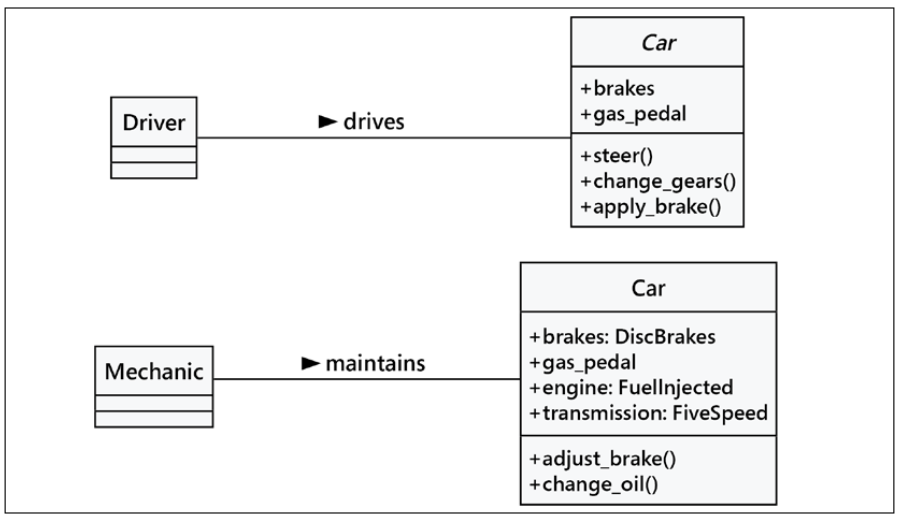
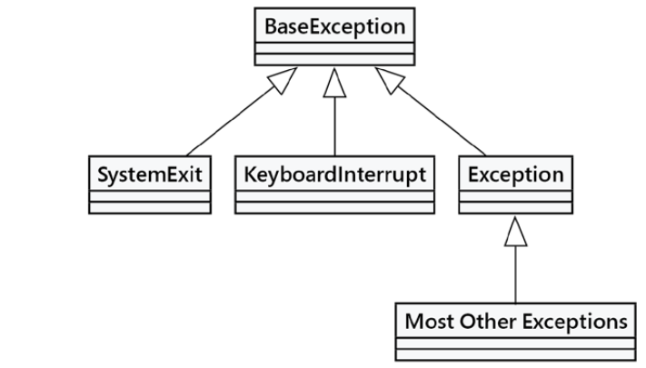

# Object-Oriented Programming with Python

Sources:

- Books:

    - [Steven F. Lott, Dusty Phillips - Python Object-Oriented Programming\_ Build robust and maintainable object-oriented Python applications and libraries-Packt Publishing (2021)](https://www.amazon.com/Python-Object-Oriented-Programming-maintainable-object-oriented/dp/1801077266)

## Introduction to object-oriented

**_Object_** - collection of data and associated behaviours

Object-oriented programming means writing code directed toward modeling objects. It is defined by describing a collection of interacting objects via their data and behavior.

**_Object-oriented design (OOD)_** is the process of converting requirements into an implementation specification. The designer must name the objects, define the behaviors, and formally specify which objects can activate specific behaviors
on other objects. The design stage is all about transforming _what_ should be done into _how_ it should be done.

**_Object-oriented programming (OOP)_** is the process of converting a design into a working program that does what the product owner originally requested.

**_Class_** describes related objects.

**_Data_** represents the individual characteristics of a certain object, its current state. `property` means particular kind of attribute.

**_Methods_** - behaviours that can beperformed on a specific class of object. The difference from usual functions is that methods have access to the attributes of the class. Method is a function attached to a specific class. The `self` parameter refers to a specific instance of the class. 

The key purpose of modeling an object is to determine what the public interface of that object will be.

**_Interface_** - collection of attributes and methods that other objects can access to interact with that object.

**_Encapsulation_** - process of wrapping (sometimes hiding) the implementation of an object. Encapsulation is, literally, creating a capsule (or wrapper) on the attributes.

**_Abstraction_** - means dealing with the level of detail that is most appropriate to a given task. It is the process of extracting a public interface from the inner details.

Example of abstraction:

<figure markdown>
  { width="800" }
</figure>

**_Composition_** - the act of collecting several objects together to create a new one.

**_Aggregation_** - similar to composition but the difference is that aggregated objects can exist independently.

Where to implement Composition and where Aggregation:

- If the composite (outside) object controls when the related (inside) objects are created and destroyed, composition is most suitable.

- If the related object is created independently of the composite object, or can outlast that object, an aggregate relationship makes more sense.

**_Inheritance_** - is like a family tree. One class can inherit attributes and methods from another class.

**_Abstract method_** say this: _"We demand this method exist in any non-abstract subclass, but we are declining to specify an implementation in this class."_ It says _what_ the class _should_ do, but provides no advice on _how_ to do it.

**_Polymorphism_** is the ability to treat a class differently, depending on which subclass is implemented.

**_Multiple inheritance_** allows a subclass to inherit functionality from multiple parent classes.

Python has a defined method resolution order (MRO) to help us understand which of the alternative methods will be used.

## Example of class implementation

```python
    class Point:
        def __init__(self, x: float=0, y: float=0) -> None:
            self.move(x, y)
        
        def move(self, x: float, y: float) -> None:
            self.x = x
            self.y = y
        
        def reset(self) -> None:
            self.move(0, 0)
        
        def calculate_distance(self, other: "Point") -> float:
            return math.hypot(self.x - other.x, self.y - other.y)

    point = Point(3, 5) # Constructing a Point instance
```

Example of abstract class:

```python
    from typing import Optional

    class Formatter:
        def format(self, string: str) -> str:
            pass
        
        def format_string(string: str, formatter: Optional[Formatter] = None) -> str:
        """
        Format a string using the formatter object, which
        is expected to have a format() method that accepts
        a string.
        """
        
        class DefaultFormatter(Formatter):
            """Format a string in title case."""
            
            def format(self, string: str) -> str:
                return str(string).title()
        
        if not formatter:
            formatter = DefaultFormatter()
        
        return formatter.format(string)
```

The `__repr__()` method is used to create a representation of the object. This representation is a string that generally has the syntax of a Python expression to rebuild the object. For simple numbers, it's the number. For a simple string, it will include the quotes. For more complex objects, it will have all the necessary Python punctuation, including all the details of the class and state of the object.

```python
    class Sample:
        def __init__(
            self,
            sepal_length: float,
            sepal_width: float,
            petal_length: float,
            petal_width: float,
            species: Optional[str] = None,
            ) -> None:
            self.sepal_length = sepal_length
            self.sepal_width = sepal_width
            self.petal_length = petal_length
            self.petal_width = petal_width
            self.species = species
            self.classification: Optional[str] = None

        def __repr__(self) -> str:
            if self.species is None:
                known_unknown = "UnknownSample"
            else:
                known_unknown = "KnownSample"
            
            if self.classification is None:
                classification = ""
            else:
                classification = f", {self.classification}"
            
            return (
                f"{known_unknown}("
                f"sepal_length={self.sepal_length}, "
                f"sepal_width={self.sepal_width}, "
                f"petal_length={self.petal_length}, "
                f"petal_width={self.petal_width}, "
                f"species={self.species!r}"
                f"{classification}"
                f")"
            )
```

We use inherritance for _adding_ new behaviour to existing classes. For _changing_ behaviour by overriding a method of superclass with a new method (with the same name). 

However, to execute the original `__init__()` method of superclass we can call it like `super().__init__()`

```python 
    class Friend(Contact):
        def __init__(self, name: str, email: str, phone: str) -> None:
            super().__init__(name, email) #(1)
            self.phone = phone #(2)
```

1. first it binds the instance to the parent class using `super()` and calls `__init__()` on that object, passing in the expected arguments. 

2. it then does its own initialization, namely, setting the `phone` attribute, which is unique to the `Friend` class.


Multiple inheritance

```python
    class EmailableContact(Contact, MailSender):
        pass
```

## Polymorphism implementation example

```python
    from pathlib import Path
    
    class AudioFile:
        ext: str

        def __init__(self, filepath: Path) -> None:
            if not filepath.suffix == self.ext:
                raise ValueError("Invalid file format")
            self.filepath = filepath

    class MP3File(AudioFile):
        ext = ".mp3"
        
        def play(self) -> None:
            print(f"playing {self.filepath} as mp3")

    class WavFile(AudioFile):
        ext = ".wav"
        
        def play(self) -> None:
            print(f"playing {self.filepath} as wav")

    class OggFile(AudioFile):
        ext = ".ogg"
        
        def play(self) -> None:
            print(f"playing {self.filepath} as ogg")
```

## SOLID design principles

**S**. Single Responsibility Principle. A class should have one responsibility. This can mean one reason to change when the application's requirements change.

**O**. Open/Closed. A class should be open to extension but closed to modification.

**L**. Liskov Substitution. (Named after Barbara Liskov, who created one of the first object-oriented programming languages, CLU.) Any subclass can be substituted for its superclass. This tends to focus a class hierarchy on classes
that have very similar interfaces, leading to polymorphism among the objects. This the essence of inheritance.

**I**. Interface Segregation. A class should have the smallest interface possible. Classes should be relatively small and isolated.

**D**. Dependency Inversion. Pragmatically, we'd like classes to be independent, so a Liskov Substitution doesn't involve a lot of code changes. In Python, this often means referring to superclasses in type hints to be sure we have the flexibility
to make changes. In some cases, it also means providing parameters so that we can make global class changes without revising any of the code.

## Handling exceptions

```python
    def funnier_division(divisor: int) -> Union[str, float]:
        try:
            if divisor == 13:
                raise ValueError("13 is an unlucky number")
            return 100 / divisor
        
        except (ZeroDivisionError, TypeError):
            return "Enter a number other than zero"
```

More complex example with `finally`:

```python
    some_exceptions = [ValueError, TypeError, IndexError, None]
    
    for choice in some_exceptions:
        try:
            print(f"\nRaising {choice}")
        if choice:
            raise choice("An error")
        else:
            print("no exception raised")
        except ValueError:
            print("Caught a ValueError")
        except TypeError:
            print("Caught a TypeError")
        except Exception as e:
            print(f"Caught some other error: {e.__class__.__name__}")
        else:
            print("This code called if there is no exception")
        finally:
            print("This cleanup code is always called")
```

Examples of performing tasks in the `finally` section:

- Cleaning up an open database connection
- Closing an open file
- Sending a closing handshake over the network

!!! note
    The `finally` clause is executed after the `return` statement inside a `try` clause. Also, pay attention to the output when no exception is raised: both the `else` and the `finally` clauses are executed.

### The exception hierarchy

The `Exception` class actually extends a class called `BaseException`. In fact, all exceptions must extend the `BaseException` class or one of its subclasses.

The hierarchy is:

<figure markdown>
  { width="600" }
</figure>

### Custom exception

```python
    from decimal import Decimal
    
    class InvalidWithdrawal(ValueError):
        def __init__(self, balance: Decimal, amount: Decimal) -> None:
            super().__init__(f"account doesn't have ${amount}")self.amount = amount
            self.balance = balance
            
        def overage(self) -> Decimal:
            return self.amount - self.balance
```

## Main recommendations to build classes

- Use methods to represent actions; things that can be done to, or performed by, the object. When you call a method, even with only one argument, it should do something. Method names are generally verbs.

- Use attributes or properties to represent the state of the object. These are the nouns, adjectives, and prepositions that describe an object.

- Default to ordinary (non-property) attributes, initialized in the `__init__()` method. These must be computed eagerly,which is a good starting point for any design.

- Use properties for attributes in the exceptional case when there's a computation involved with setting or getting (or deleting) an attribute. Examples include data validation, logging, and access controls. We'll look at cache management in a moment. We can also use properties for lazy attributes, where we want to defer the computation because it's costly and rarely needed.


!!!note
    Good names and docstrings are essential. Each class, method, function, variable, property, attribute, module, and package name should be chosen thoughtfully.
    When writing docstrings, don't explain how the code works (the code should do that). Be sure to focus on what the code's purpose is, what the preconditions are for
    using it, and what will be true after the function or method has been used.