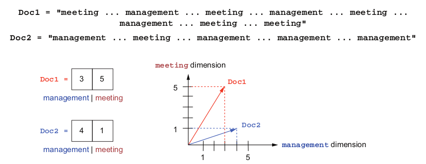

# Natural Language Processing
## Sources Overview
- Books:
    - [Ekaterina Kochmar - Getting Started with Natural Language Processing-Manning (2022)](https://www.amazon.com/Getting-Started-Natural-Language-Processing/dp/1617296767)

## Sample Use Cases

- Information search
- Information retrieval

## Basics
In NLP important concept is a vector. Characters can be represented as vectors, words, or documents can be represented as vectors. 

For example, two documents can be represented as vectors based on the number of occurences of specific words.

!!! Example

    === "Schema"
        <figure markdown>
            { width="800" }
        </figure>

    === "Python Implementation"
        ``` python
        doc1 = "meeting ... management ... meeting ... management ... meeting" # (1) 
        doc1 += "... management ... meeting ... meeting" 
        vector = [0, 0] # (2)
        for word in doc1.split(" "):
            if word == "management":
                vector[0] = vector[0] + 1 # (3)
            if word == "meeting":
                vector[1] = vector[1] + 1 # (4)
        print(vector) # (5)
        ```

        1.  represents a document based on keywords only
        2.  initializes array vector
        3.  count for "management" is incremented in cell 0
        4.  count for "meeting" is incremented in cell 1.
        5.  [3, 5]

Two vectors can be compared between each other by either length or by measuring angle between them. 


!!! info

    **Cosine similarity** estimates the similarity between two nonzero vectors in space (or two texts represented by such vectors) on the basis of the angle between these vectors — for example, the cosine of 0° equals 1, which denotes the maximum similarity, and the cosine of 180° equals –1, which is the lowest value. Unlike Euclidean
    distance, this measure is not affected by vector length.