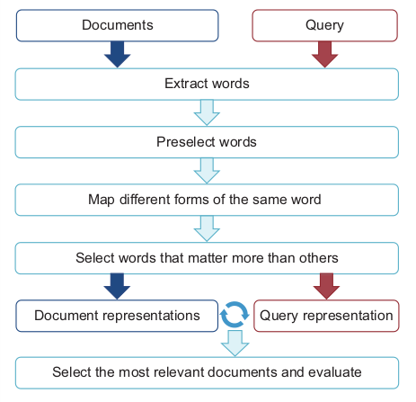
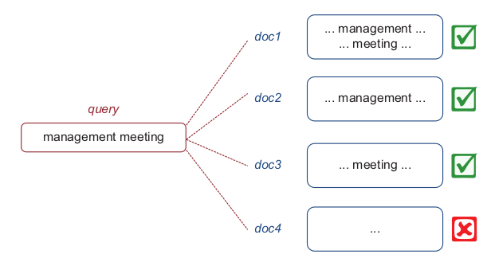

# Information Search / Information Retrieval

This section explains search algorithm from beginning to end.

## Understanding the Purpose of the Project

Information search algorithm in a nutshel:

{ align=center }

**_Boolean search algorithm_**

It is simple search algo that selects all documents that contain any of the words from the query

{ align=center }

**_Preprocessing step_**

Preprocessing step is needed to remove words and punctuation which does not contain any useful information for the purpose of our search algorithm.

```python
    import nltk
    import string
    nltk.download('stopwords')
    from nltk import word_tokenize
    from nltk.corpus import stopwords

    def process(text):
        stoplist = set(stopwords.words('english'))
        word_list = [word for word in word_tokenize(text.lower()) \
            if not word in stoplist and not word in string.punctuation]

        return word_list

    word_list = process(documents.get("1"))
    print(word_list)
```
