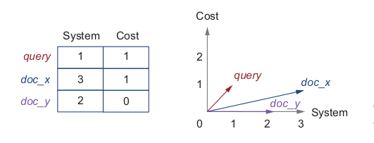

# Information Search / Information Retrieval

This section explains search algorithm from beginning to end.

## Understanding the Purpose of the Project

Information search algorithm in a nutshel:

{ align=center }

**_Boolean search algorithm_**

It is simple search algo that selects all documents that contain any of the words from the query

{ align=center }

### Preprocessing step

```python
import nltk
import string
from nltk import word_tokenize
from nltk.corpus import stopwords
from nltk.stem.lancaster import LancasterStemmer

def process(text):
    stoplist = set(stopwords.words('english'))
    st = LancasterStemmer()
    word_list = [st.stem(word) for word in word_tokenize(text.lower())
                if not word in stoplist and not word in string.punctuation]

    return word_list

word_list = process(documents.get("27"))
print(word_list)

word_list = process("organize, organizing, organizational, organ, organic, organizer")

print(word_list)

# Example:
# Input = "Cost Analysis and Simulation Procedures for the Evaluation of Large Information Systems ..."
# Output = ['cost', 'analys', 'sim', 'proc', 'evalu', 'larg', 'inform','system', ...]

```

### Information weighting

Code to estimate term frequency in documents and queries:

```python
    def get_terms(text):
        stoplist = set(stopwords.words('english'))
        terms = {}
        st = LancasterStemmer()
        word_list = [st.stem(word) for word in word_tokenize(text.lower())
                    if not word in stoplist and not word in string.punctuation]
        for word in word_list:
            terms[word] = terms.get(word, 0) + 1

        return terms

    doc_terms = {}
    qry_terms = {}

    for doc_id in documents.keys():
        doc_terms[doc_id] = get_terms(documents.get(doc_id))

    for qry_id in queries.keys():
        qry_terms[qry_id] = get_terms(queries.get(qry_id))

    print(len(doc_terms))
    print(doc_terms.get("1"))
    print(len(doc_terms.get("1")))
    print(len(qry_terms))
    print(qry_terms.get("1"))
    print(len(qry_terms.get("1")))
```

Code to represent the data in a shared space:

```python
    def collect_vocabulary(): # (1)
        all_terms = []
        for doc_id in doc_terms.keys():
            for term in doc_terms.get(doc_id).keys():
                all_terms.append(term)
        for qry_id in qry_terms.keys():
            for term in qry_terms.get(qry_id).keys():
                all_terms.append(term)
        return sorted(set(all_terms))

    all_terms = collect_vocabulary()
    print(len(all_terms))
    print(all_terms[:10]) # (2)

    def vectorize(input_features, vocabulary):
        output = {}
        for item_id in input_features.keys():
            features = input_features.get(item_id)
            output_vector = []
            for word in vocabulary: # (3)
                if word in features.keys():
                    output_vector.append(int(features.get(word)))
                else:
                    output_vector.append(0)
            output[item_id] = output_vector
        return output

    doc_vectors = vectorize(doc_terms, all_terms)
    qry_vectors = vectorize(qry_terms, all_terms) # (4)

    print(len(doc_vectors))
    print(len(doc_vectors.get("1460")))
    print(len(qry_vectors))
    print(len(qry_vectors.get("112")))  # (5)
```

1. Collect the shared vocabulary of terms from documents and queries and return it as a
   sorted list.
2. Print out the length of the shared vocabulary and check the first several terms in the vocabulary.
3. Represents each query and each document with a dictionary with the same set of keys
4. Using the vectorize method, you can represent all queries and documents in this shared space.
5. Print out some statistics on these data structures.

Vector representation of documents and query:

<figure markdown>
{ width="500" }
</figure>

### Weighing words with inverse document frequency

```python
    idf("inform") = log10(1460/(651+1)) ≈ 0.35
    idf("dissemin") = log10(1460/(68+1)) ≈ 1.33
```

The general formula:

$$idf(term) = log_{10} \ ( \frac{N}{df(term) + 1})$$

_N_ - total number of documents in the collection

