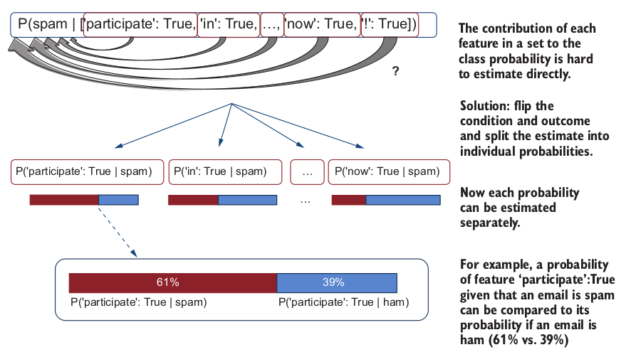
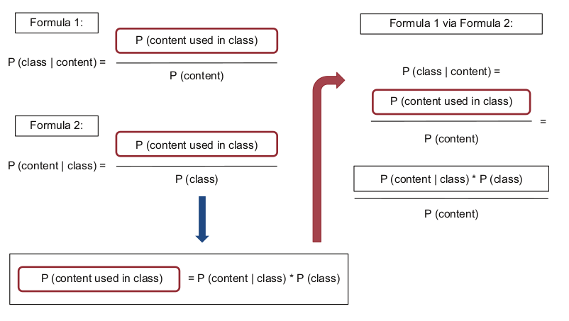

# Text Classification

In this section the knowledge about text classification is summarized based on the _spam filtering project_ example.

!!! info
    **Classification** refers to the process of identifying which category or class among the set of categories (classes) an observation belongs to based on its properties. In machine learning, such properties are called _features_ and the class names are called _class labels_. If you classify observations into two classes, you are dealing with _binary_ _classification_; tasks with more than two classes are examples of _multi-class classification_.

## Understanding the Purpose of the Project

**Provided by client**: dataset of spam and normal emails from the past.

**Task**: build a spam filter which can predict if any future incoming email is spam or not.

### Questions to think about

- What is the format of provided data?
- How to use provided data?
- What features of the emails might be useful, how to extract them?
- What are sequence of steps in the application?

### Suggested pipeline of the project

1. Define classes
2. Split text of each email into words
3. Extract useful features
4. Train a classifier
5. Test and evaluate

**1. Define classes**
Define the label of each class and which data represents which class.

**2. Split into words**
Preprocess the raw text from email in order to prepare it for machine learning classifier. Split text into words by whitespaces and punctuation:

```python
    text = 'Define which data represents "ham" class and which data represents "spam" class for the machine learning algorithm.'
    delimiters = ['"', "."] #(1)
    words = []
    current_word = "" #(2)
    for char in text:
        if char == " ":
            if not current_word == "":
                words.append(current_word)
                current_word = "" #(3)
        elif char in delimiters:
            if current_word == "": #(4)
                words.append(char)
            else:
                words.append(current_word)
                words.append(char)
                current_word = "" #(5)
        else:
            current_word += char #(6)
    print(words)
```

1. initialize list of delimiters
2. the **current_word** variable keeps track of the word currently being processed.
3. check if the character is a whitespace and the current_word is not empty
4. check if the character is one of the punctuation marks and there is nothing stored in the current_word yet
5. check if the character is one of the punctuation marks and there is information stored in **current_word**
6. check if the character is any other letter; that is, not specified as a delimiter and not a whitespace

To solve the problem with cases like _U.S.A._ and _U.K._ which under the above preprocessor are splitted into ['U', '.', 'S', '.', 'A', '.'] and ['U', '.', 'K', '.'], we can use tokenizer.

!!! info
    **Tokenization** is the process of word token identification or extraction from the running text. It is often the first step in text preprocessing. Whitespaces and punctuation marks often serve as reliable word separators; however, simple approaches are likely
    to run into exceptions like “U.S.A.” and similar. Tokenizers are NLP tools that are highly optimized for the task of word tokenization, and they may rely on carefully
    crafted regular expressions or may be trained using machine-learning algorithms.

**3. Extract and normalize features**
Put all words to lowercase.

**4. Train a classifier**
Choose machine learning model and train it on the preprocessed data. Split dataset into _train_ and _test_ before training (typically 80% for training, and 20% for testing).

_Naïve Bayes_ - probabilistic classifier, it makes class prediction based on the estimation which outcome is most likely. The probability in this case is _conditional_, because it depends on condition (words as features). 
```
If P(spam | content) = 0.58 and P(ham | content) = 0.42, predict spam
If P(spam | content) = 0.37 and P(ham | content) = 0.63, predict ham
```
**_How it works on practice_**
Estimate the probability that an email is spam or ham based on its content, taking the number of times this content lead to a particular outcome:

$$
\operatorname{P}(spam\ |{'Participate\ in\ our\ lottery!'}) = \frac{num(spam\ emails\ with\ 'Participate\ in\ our\ lottery!')}{num(all\ email\ with\ 'Participate\ in\ our\ lottery!')}
$$

In general the formula looks like this:

$$
\operatorname{P}(outcome\ |{condition}) = \frac{num\ of\ times(condition\ led\ to\ outcome)}{num\ of\ times(condition\ applied)}
$$

The problem here is that we are estimating of particular combination of words (as features), but it may not be many times when we meet exactly the same combination. Therefore, we may not generalise the classifier efficiently. 
The solution is to split the estimation into smaller bits and establish the link between individual features.

<figure markdown>
  { width="800" }
</figure>

Estimate probability by using two formulas:

=== "Schema"
    <figure markdown>
    { width="800" }
    </figure>
    

=== "Math"

    **Formula 1**. Proportion of times we've seen 'Participate in our lottery!' in a spam email among all emails with this content.

    $$
    \operatorname{P}(spam\ |{'Participate\ in\ our\ lottery!'}) = \frac{P('Participate\ in\ our\ lottery!'\ is\ in\ spam\ email)}{P('Participate\ in\ our\ lottery!'\ is\ used\ in\ an\ email)}
    $$

    **Formula 2**. Proportion of times we've seen 'Participate in our lottery!' in a spam email among all spam emails.

    $$
    \operatorname{P}({'Participate\ in\ our\ lottery!'|spam}) = \frac{P('Participate\ in\ our\ lottery!'\ is\ in\ spam\ email)}{P(an\ email\ is\ spam)}
    $$

    **General formula (combination of the two previous ones)**:

    $$
    \operatorname{P}({class|content}) = \frac{P(content\ in\ class)}{P(content)} = \frac{P(content|class)\times P(class)}{P(content)}
    $$

    !!! info
        _P(class)_ - probability of each class, i.e. distribution of the class in the dataset. This forms prior probability for the classifier. If the dataset is unbalanced, potential probability is inclined respectively. 

        _P(content|class)_ - likelihood that we see this particular content given that the email is spam or ham. 


Naïve Bayes assumes that the features are independent of each other, i.e. chances of seeing a word 'lottery' in an email are independent of seeing a word 'new' or any other word. Therefore we can estimate the probability of the whole sequence of features by product of probabilities of each feature in this class: 

$$
\operatorname{P}({['participate': True,\ 'in': True,\ ...,\ '!': True]|spam}) = {P('participate': True|spam)\times P('in': True|spam)\times ...\times P('!': True|spam)}
$$

And general formula is:

$$
\operatorname{P}({[f_1, f_2, ..., f_n]|class}) = {P(f_1|class)\times P(f_2|class)\times ...\times P(f_n|class)}
$$


**_How exactly classifier algorithm works_**

=== "Training Phase"

    1. Learns prior probabilities
    This is simply initial class distribution. For example:
        - P(ham) = 0.71
        - P(spam) = 0.29
    2. Learns probabilities for each feature given in the classes. 
    This is the proportion of emails with each feature in each class. For example:
        - P ('meeting': True|ham) = 0.50

=== "Test Phase"

    Predict new email class based on the probabilities of each feature of the content:

    $$
    \begin{align}
        \begin{cases}
        P(f_1|spam)\times ...\times P(f_n|spam)\times P(spam) \geq P(f_1|ham)\times ...\times P(f_n|ham)\times P(ham) \implies spam\\ 
        otherwise \implies ham\
        \end{cases}
    \end{align}
    $$

**_Code implementation_**
```python
    from nltk import NaiveBayesClassifier, classify

    def train(features, proportion):
        train_size = int(len(features) * proportion) #(1)
        train_set = features[:train_size]
        test_set = features[train_size:]
        
        print (f"Training set size = {str(len(train_set))} emails")
        
        print (f"Test set size = {str(len(test_set))} emails")

        classifier = NaiveBayesClassifier.train(train_set) #(2)
        return train_set, test_set, classifier
    
    train_set, test_set, classifier = train(all_features, 0.8) #(3)
```

1. split dataset into train and test parts
2. initialize a classifier
3. apply the train function using 80% of dataset for training

**5. Classifier evaluation**

$$
\operatorname{Accuracy} = \frac{num(correct\ predictions)}{num(all\ test\ instances)}
$$

**_Code implementation_**

Define an estimation function which estimates the accuracy of the classifier on each dataset
```python
    def evaluate(train_set, test_set, classifier):
        print (f"Accuracy on the training set = {str(classify.accuracy(classifier, train_set))}")
        
        print (f"Accuracy of the test set = {str(classify.accuracy(classifier, test_set))}")
        
        classifier.show_most_informative_features(50) #(1)
    
    evaluate(train_set, test_set, classifier)
```

1. print top 50 most informative features (words). The words that are most strongly associated with a particular class. It is calculated as $max[P(word: True | ham) / P(word: True | spam)]$ for most predictive _ham_ features, and $max[P(word: True | spam) / P(word: True | ham)]$ for most predictive _spam_ features (check out [NLTK’s documentation](https://www.nltk.org/api/nltk.classify.naivebayes.html) for more information).

**_Check the contexts of specific words_**

```python
    from nltk.text import Text

    def concordance(data_list, search_word):
        for email in data_list:
        word_list = [word for word in word_tokenize(email.lower())]
        text_list = Text(word_list)
        if search_word in word_list:
            text_list.concordance(search_word)
    
    print ("STOCKS in HAM:")
    concordance(ham_list, 'stocks')

    print ("\n\nSTOCKS in SPAM:")
    concordance(spam_list, 'stocks')
```

**6. Use spam filter on new emails in practice**

Here is the code for inference of the model on new emails.

```python
    test_spam_list = ["Participate in our new lottery!", "Try out this new medicine"]
    test_ham_list = ["See the minutes from the last meeting attached", "Investors are coming to our office on Monday"]
    test_emails = [(email_content, "spam") for email_content in test_spam_list]
    test_emails += [(email_content, "ham") for email_content in test_ham_list]

    new_test_set = [(get_features(email), label) for (email, label) in test_emails]
    
    evaluate(train_set, new_test_set, classifier)

    while True:
    email = input("Type in your email here (or press 'Enter'): ")
    if len(email)==0:
        break
    else:
        prediction = classifier.classify(get_features(email))
        print (f"This email is likely {prediction}\n")
```