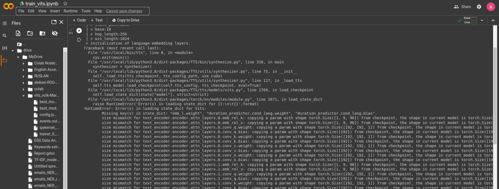
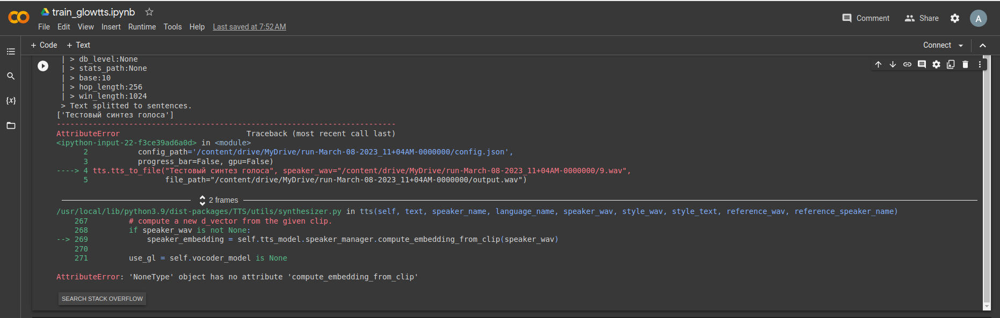

!!!info
**Voice cloning**, also known as text-to-speech synthesis or speech synthesis, is the process of creating a computer-generated version of a person's voice. This technology has many applications, including creating personalized voice assistants, generating voiceovers for videos, and creating text-to-speech systems for people with disabilities.

There are two main approaches to voice cloning: concatenative synthesis and parametric synthesis.

## Concatenative Synthesis:

Concatenative synthesis is a method of creating a synthetic voice by recording a large number of short speech segments and then stitching them together to form words and phrases. The recorded segments are carefully selected to capture the speaker's unique voice characteristics, such as pitch, rhythm, and tone. The result is a synthesized voice that sounds like the original speaker, but can produce any text that is entered into the system.

The process of creating a synthetic voice using concatenative synthesis involves several steps:

1. _Data Collection_: The first step is to collect a large amount of speech data from the target speaker. This can be done by recording the speaker reading a set of scripted sentences, or by using existing recordings of the speaker.

2. _Feature Extraction_: Next, the speech data is analyzed to extract specific features that are unique to the speaker's voice. These features can include pitch, rhythm, and tone, as well as more subtle characteristics like vocal tics and accent.

3. _Speech Segmentation_: The speech data is then segmented into small units of sound, typically around 10-30 milliseconds in length. These units are called "phonemes" and they represent the basic building blocks of speech.

4. _Alignment_: The phonemes are then aligned with the corresponding text, so that the system knows which phoneme to use for each word.

5. _Concatenation_: Finally, the system assembles the speech segments into the final synthesized voice, using sophisticated algorithms to smooth the transitions between phonemes and create a natural-sounding voice.

## Parametric Synthesis:

Parametric synthesis involves training a machine learning model on a large amount of speech data, typically from multiple speakers, to learn the underlying patterns of speech production. The model is then used to generate new speech based on text input.

The process of creating a synthetic voice using parametric synthesis involves several steps:

1. _Data Collection_: The first step is to collect a large amount of speech data from multiple speakers. This can be done by recording speakers reading a set of scripted sentences, or by using existing recordings of speakers.

2. _Training the Model_: Next, a deep neural network is trained on the speech data, using a technique called "sequence-to-sequence learning." The model learns to map sequences of input text to sequences of speech output.

3. _Synthesizing Speech_: Finally, the trained model can be used to generate new speech based on text input. The model is capable of generating speech in the style of any of the speakers used in the training data, as well as creating entirely new voices that have never been heard before.

Parametric synthesis is more promissing approach and in detail it works as follows steps:

**Preprocessing**: The speech data is preprocessed to extract useful features, such as the spectral envelope, the fundamental frequency (pitch), and the duration of each phoneme.

**Text Input**: The model takes text input as its input, such as a sentence or a paragraph.

**Encoding**: The text input is encoded into a sequence of vectors that represent the text.

**Synthesis**: The model generates a sequence of vectors that represents the synthesized speech. This sequence of vectors is then transformed into an audio waveform using a signal processing technique called "vocoder".

**Training**: The deep neural network is trained on the speech data and text input to learn the mapping between the two. This involves optimizing the model's parameters to minimize the difference between the synthesized speech and the actual speech.

Examples of pre-trained voice cloning models:

**Tacotron 2**: This is a state-of-the-art text-to-speech model developed by Google that uses a combination of convolutional and recurrent neural networks to generate speech. The model has been trained on a large dataset of speech data and can generate speech that sounds natural and expressive.

**WaveNet**: This is a neural network-based model for generating speech developed by DeepMind, a research company owned by Google. WaveNet is capable of generating high-quality speech that sounds very natural and human-like. .

**Deep Voice 3**: This is a text-to-speech synthesis model developed by Baidu Research that uses a deep neural network to generate speech. Deep Voice 3 is capable of generating speech that sounds very natural and expressive.

**Mozilla TTS**: This is an open-source text-to-speech synthesis system developed by Mozilla that uses a deep neural network to generate speech. Mozilla TTS is capable of generating high-quality speech that sounds natural and expressive.

## Training Models for Voice Cloning

1. **Choose library for TTS and STT**
   I chose up [Coqui TTS](https://tts.readthedocs.io/en/latest/index.html#) as it looked promising in terms of code usability, library support, open-source solutoin and number of pretrained models. It has good results regarding voice clonning for several languages, but not for Russian.
   The most relevant idea seemed to me to pick up multilingual _Vits_ model and train it on [RUSLAN training dataset](https://www.kaggle.com/datasets/freezerainml/ruslan)

2. **Train model**
   You can have a look at [My Google Colab Notebook](https://colab.research.google.com/drive/1W8zDyJh9LejR50xNbGfLd_92snyxVFXv?usp=sharing) as a result of my training attempts. Another training notebook example can be found here - [Kaggle training notebook](https://www.kaggle.com/code/freezerainml/vits-ruslan-training/notebook) on Kaggle.

3. **Results**
   Unfortunately, Kaggle trainnig notebook resulted in trained model without speaker embedded. And dozen of my training attempts were unlucky so far.
   The issues rised during model training need to be urther investigated.

4. **Further experiments**
   After hours of diving deeper into Coqui library, I was able to run successfully trained Vits TTS model [Vits Google Colab Notebook](https://colab.research.google.com/drive/1JI5XfNt8_HYNB6A9oIapZXje670oT6L2?usp=sharing). It usually takes loooong hours of training in Google Colab, so after one epoch I checked if at least some results can be hearable. And....the model didn't work from restoring checkpoint:

   { width="800" }

   The error happens when the model tries to initialize `language embedding layers`, and I should've used it as a hint, but it didn't ring the bell for me at that time.
   I investigated the error and used recommendations regarding checking the initial parameters of the model and parameters from checkpoints. But I didn't find a correct solution, and clocks was ticking. Sad and disappointed...

   

   Well, yea, but it means nothing without results, so I decided to keep experimenting, and at least make good old Tacotron2 works.
   I trained Tacotron2 TTS model see **Tacotron Model Training** in [Google Colab Notebook](https://colab.research.google.com/drive/1JI5XfNt8_HYNB6A9oIapZXje670oT6L2#scrollTo=XanWwzrUknrq&line=1&uniqifier=1). Tacotron is lighter and can be train a bit faster thatn Vits or GlowTTS. After three epochs I checked if the model can be resored from checkpoints and synthesize at least something. 
   
   The result is:

   <audio controls="controls">
      <source type="audio/wav" src="../audio/tacotron2_3epoch.wav"></source>
   </audio>

   Well, something definitely goes wrong...It is learning nothing🧐

   Alright, another try - **GlowTTS** model:
   Same steps, but this time I trained model for 6 epochs first, checked that it can restore from checkpoints, and trained on 11 more epochs. So in total the model was trained on 17 epochs, which is still a small number, but it should be enough to check that at least it learns something. 
   Please check my [GlowTTS Google Colab Notebook](https://colab.research.google.com/drive/1wzDgwgXW3hbus6UEk9fkIFRiDpd08PNh?usp=sharing) for code and results.

   The synthesis result for the text *"Вот и десять лет мы отвечали наверное на этот вопрос, главный, и вместе с ним на много других"* is:

   <audio controls="controls">
      <source type="audio/wav" src="../audio/growtts_17epocs.wav"></source>
   </audio>

   Speech synthesis still sounds bad, but it starts recognizing words, so I'm on the right way. Just need to keep training (several days, at least up to 100 epochs), and I will probably get good results 🤓

   After that, I decided to check, just by any chance, if the model can [clone voice from a sample file](https://colab.research.google.com/drive/1wzDgwgXW3hbus6UEk9fkIFRiDpd08PNh?authuser=3#scrollTo=lyopXwhvRsGt&line=1&uniqifier=1). And...

   { width="800" }
     
   No way😟...`compute_embedding_from_clip` looks like the model doesn't have speaker embedding by default, and I had to specify it on initialization, before training...?! I found an answer on my question [here](https://github.com/coqui-ai/TTS/discussions/1178) 🤦‍♂️

   { align=left } 
   
   **Outcomes and insights**: Yes, I know, totally screwed up. Lessons learnt (hopefully). This task on voice cloning was failed so far, but challenged me a lot. 
   I think it should be definitely another, simpler way to do voice cloning for target language (if you couldn't find already pretrained good model ad download it, of course). Probably I just have lack of knowledge, but I will figure out it later. Never give up!
   Next idea is to research and understand which models [Resemble.ai](https://www.resemble.ai/russian-tts/) uses for so many languages, and read more papers about language model transfering. 
