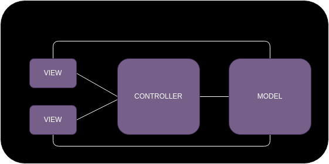

# MV* Architectural Patterns
Brief description of the following patterns:

- MVC
- MVVM
- MVP

## Key Ideas

Split business logic of the application from interface. 

<figure markdown>
  { width="800" }
</figure>

_Business_ _logic_ is the core functionality that solves specific business problem (
for example, user registration, payments, add item to the basket, blog post creation, etc.)
It is an algorithm of process that we want to implement to transform data somehow in order
to provide a service (solve business problem). Sometimes it is called "use case". 

_Interface_ is the graphical interface that user interacts with. Such as forms, buttons, etc.

_Controller_ is an intermediary between the UI (View) and business logic (Model). It should be
'thin', so it should not duplicate business logic or take any part of it, only some 'light' features,
such as values validation. 

