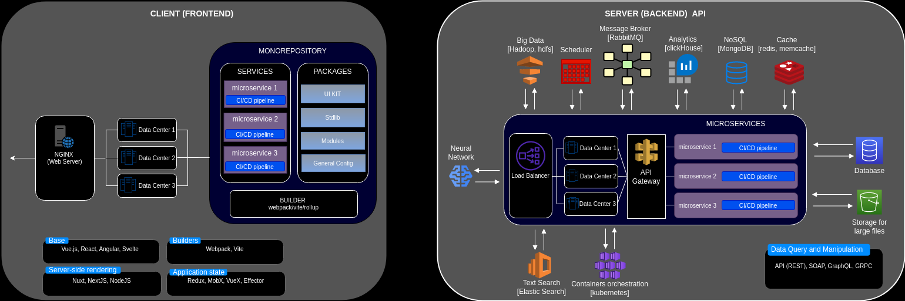

# Software Architecture

This section contains knowledge about software architecture concepts, patterns, and best practices.
Due to my love of Python, architectural examples are provided in Python.

## Sources Overview

### Books

- [Software Architecture for Busy Developers](https://www.amazon.com/Software-Architecture-Busy-Developers-architect/dp/1801071594)

### YouTube Videos

- [Architecture of modern WEB applications. Evolution from A to Z](https://www.youtube.com/watch?v=S0e_5a2WB60&ab_channel=UlbiTV)

### Courses
- [Educative.io](https://www.educative.io/courses/clean-architecture-python/qArNV477JGp)

## Main Concepts

**_Architecture_** - set of modules and components of the system, description of how these modules and 
components should be developed, how they should be connected, and interfaces that specify the purpose 
of each module and component. 

Components inside modules should be **tightly-coupled**.

Modules should be **loosely-coupled**. Deletion/revision of a module should be simple, and should not
affect other modules significantly.

**_Separation of concerns_** - different parts of a system should manage different parts of the process.

**_Inversion of control_** - helps to avoid strong coupling between components of the system.
It realised by wrapping components and expose specific interface. Thus, components can be connected via
interface rather than their hard-coded specific implementation. 

Think of the following responsibilities while architecting software:

- Address functional and non-functional requirements
- Use technical standards, coding best practices and design patterns
- Interact with stakeholders to ensure smooth development and implementation
- Play an active role in the development process
- Proactive watching over tech trends and paradigm shifts, but do not follow them blindly

**_Main architectural principles_**

- DRY
- SOLID
- KISS
- PATTERNS

### Architecture of WEB Application
<figure markdown>
  { width="800" }
</figure>

Each component of the above schema is described in the respective topic of the [Backend](backend/index.md) or [Frontend](frontend/index.md)  sections.
### Architectural Styles

1. **Monolith**
    - benefits:
        1. easy to develop
        2. easy to deploy (as a single package)
        3. easy to monitor

        The key is simplicity, as long as the application remains lightweight.

    - challenges:
        1. adding new features and debugging becomes complicated while the app grows
        2. the code is tightly coupled, so it violates single responsibility principle
        3. lack of granular scalability
        4. availability at risk (error in one module can cause of cascade blocking of the whole app)
        5. high risk of technical debt

2. **Service Oriented Architecture (SOA)**

    It has middle core componet - Enterprise Service Bus

    - benefits:
        1. decouple application and services
        2. better governance, as SOA aims to provide single source of truth
        3. reusability of components
        4. technology agnostic
        5. scalability, as each service is independent
   - challenges:
        1. lack of agility
